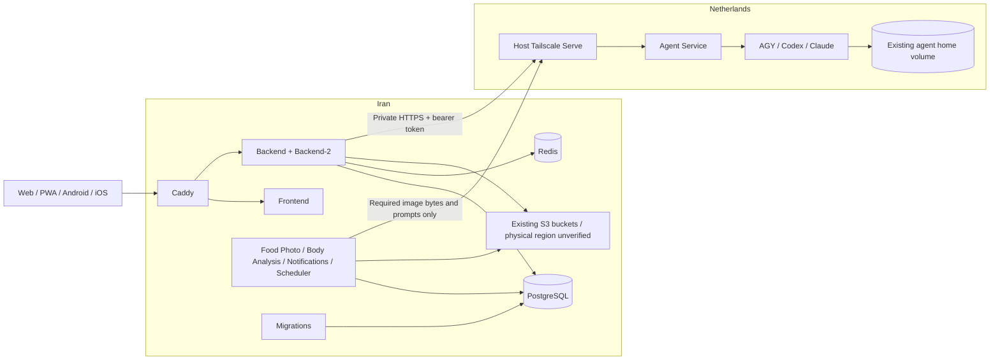

# Fitician: Iran application and Netherlands Agent

Status: local architecture and implementation prepared; **not production-ready**. No live VPS, DNS,
production database, credential or volume changes are authorized by this document.
Audit baseline: branch `main`, commit `bf182dd4`, 2026-10-10. Implementation is on
`feat/iran-netherlands-architecture`. All unrelated untracked work is preserved.

## Placement and data flow



Application database, sessions, queues, administrator task/provider configuration and
worker leases stay in Iran. Agent CLI credentials stay in the existing Netherlands
home volume. S3's **physical location is unchanged and unverified**: moving application
compute does not relocate object data. If all user data must physically reside in Iran,
the owner must verify the existing public/private bucket regions or authorize a separate
object-store migration. Do not silently copy or expose private objects.

The split retains FastAPI provider interfaces, task/model routing, encrypted administrator
credentials, API response shapes, frontend load balancing and mobile contracts. No
Kubernetes, new queue, exit node, public Agent endpoint or permanent SSH RPC is introduced.

## Audit findings

| Area | Inspected contract and consequence |
| --- | --- |
| Git/local runtime | Clean tracked baseline; extensive unrelated untracked files. Local Compose has healthy Agent, Redis, photo workers and scheduler; notification worker restarts with status 137. API and DB containers were not running at audit time. Do not use this existing stack as test evidence. |
| Development | `compose.yaml` builds code, uses PostgreSQL/Redis, migrations, Agent and workers; Agent mounts read-only local body/food media. Backend and workers depend on local Agent health. This workflow remains unchanged. `.env.example` is a template, `backend/.env` is the local app configuration. Only variable names/presence are inspected, never values. |
| Replicas | `compose.multi.yaml` extends dev Backend into Backend-2, uses a local Caddy on loopback 8080 and fake body provider for drills. `compose.host-backend.yaml` is a separate host-dev DB/frontend path. `compose.adapter-preview.yaml` contains an absolute historical worktree build context and is not a production contract. |
| Production | `compose.prod.yaml` has all services, hard-coded `http://agent-service:9001`, local Agent health startup dependencies and Compose-owned volume names. New standalone regional files replace this only after approved cutover; legacy file stays available. |
| Monitoring | `compose.observability.yaml`, `ops/monitoring/{prometheus.yml,alerts.yml}`, Grafana provisioning: loopback UI ports, API and Redis exporter targets, no Agent scrape. Optional on Iran; include monitoring budgets explicitly and assess disk retention. |
| API health | `backend/app/main.py` creates HTTP clients without calling Agent at startup. `/healthz` checks DB, `/readyz` checks DB and reports Redis degradation, `/livez` is process health. Agent is not an API readiness dependency. |
| HTTP authentication | `agent-service/app/security.py`: constant-time bearer comparison, minimum 32-character token. Only `/healthz` is public inside the private ingress. `/v1/capabilities`, `/v1/test`, generation/image, runtime proxy and auth APIs require token. Preserve the current token; do not rotate as part of split. |
| Image transport | `backend/app/ai/task_provider.py` supplies `PrivateMediaResolver` in S3 mode; `body_analysis/providers/agent_service.py` reads private objects in Iran and POSTs multipart to `/v1/analyze-images`. Agent validates MIME, count, per-file/total limits and deletes request workspaces. `/v1/analyze-stored-images` needs same-host files and remains dev-only in this topology. No S3 credential, signed public URL or private-volume mount goes to Netherlands. |
| Administration | `body_analysis/admin_config/service.py` and admin routers proxy Agent capabilities, provider tests, model profiles, runtime proxy and CLI auth through configured URL/token. Persisted task/provider settings remain in Iran DB; active Agent auth sessions are memory-only, persistent login state is in `/home/agent`. Restart can terminate an in-progress auth flow; existing login state is retained. |
| Durable jobs | `body_analysis/worker.py` and `nutrition/food_photo_worker.py`: PostgreSQL claims with SKIP LOCKED, committed leases, bounded attempts/backoff, stale lease reclamation and safe normalized provider failures. Scheduler runs in Iran; notifications have their own durable worker. Redis is cache/rate-limit coordination, not the AI job source of truth. |
| Timeout/recovery | Task generation timeout defaults to 420 seconds, max 600 in admin settings; connect timeout defaults to 5 seconds. Food lease defaults 600s, body 900s. Keep leases above the maximum full request duration including upload/storage time; set food lease higher if using 600s task limits. An interrupted remote request can continue at the CLI until its own deadline; stale-lease replay is at-least-once, not exactly-once. Avoid duplicate user result persistence using existing lease ownership checks. |
| Release | `.github/workflows/{ci,frontend-only,backend-only,deploy-production,deploy-component,load-test}.yml`, `ops/{ci-classify,ci-release-gate,check-component-release}.py`: exact-SHA evidence, immutable image publishing, full/component selection, schema-safe release gates. Infra changes require full CI. Existing legacy automation must be retired/disabled during approved cutover. |
| Deploy/verify | `ops/{deploy-production,deploy-component,verify-production}.sh` assume one project including Agent, one VPS credential set, one full rollback and public fitician.fit ingress. Regional scripts use independent contracts/projects/status/rollback and do not require Agent for Iran verification. |
| Backup/migration | `ops/backup-production.sh` streams custom pg_dump through age before S3 upload and verifies upload size. Alembic runs in the migrations service, DB-backed test fixtures rebuild only isolated test DBs. Schema-changing failures require manual restore, not image-only rollback. Restore/hash/row-count validation remains an explicit migration gate. |
| Capacity | Current legacy defaults are PostgreSQL 320 MiB/API 704 MiB, unlike a prior backup remediation note. New Iran defaults use PostgreSQL 512 MiB/API 512 MiB and bounded migration memory. Backup peak and real traffic load must be remeasured; local budgets are ceilings, not throughput evidence. |

## Network design

Preferred candidate: host-installed Tailscale on each VPS, Netherlands host Serve
terminating HTTPS and forwarding to Agent's **127.0.0.1:9001** Docker publication.
Iran containers connect through the Iran host's Tailscale interface to the Netherlands
node's full `*.ts.net` name. Existing bearer authentication remains a second boundary.
This avoids another VPN container, subnet router and cross-host media mounts. Serve is
private to a tailnet; never enable Funnel.
[Serve reference](https://tailscale.com/docs/reference/tailscale-cli/serve).

Alternative: direct WireGuard between the two fixed VPS addresses. Use it if real
Iran-provider tests show unreliable Tailscale control, DERP or direct paths. Retaining
single-host production is the cutover rollback until both candidates are qualified.
Tailscale is the requested preference, not a claim of Iranian network availability.

Replace broad default allow-all rules with an owner-reviewed policy (example):

```json
{
  "tagOwners": {
    "tag:fitician-iran": ["autogroup:admin"],
    "tag:fitician-agent": ["autogroup:admin"]
  },
  "grants": [
    {"src": ["tag:fitician-iran"], "dst": ["tag:fitician-agent"], "ip": ["tcp:443"]}
  ],
  "tests": [
    {"src": "tag:fitician-iran", "accept": ["tag:fitician-agent:443"], "deny": ["tag:fitician-agent:9001", "tag:fitician-agent:22"]},
    {"src": "tag:fitician-agent", "deny": ["tag:fitician-iran:5432", "tag:fitician-iran:6379"]}
  ]
}
```

This policy intentionally grants no administrative SSH. Add only explicit owner/admin
access separately; keep public SSH restricted to administrator/CI sources and pinned
host keys. Never grant `autogroup:member` access to Agent. Node tags are granted only by
administrators. Policies are additive: remove existing broad grants/ACLs or the example
does not restrict access. Run policy tests in the real tailnet before applying.
[Grants syntax](https://tailscale.com/docs/reference/syntax/grants).

On Netherlands, after owner approval and node enrollment:

```sh
tailscale serve --bg --https=443 http://127.0.0.1:9001
tailscale serve status
```

Set Iran `AGENT_SERVICE_BASE_URL=https://<full-netherlands-node-name>.ts.net`.
Use normal TLS verification; no `verify=False` or insecure curl. Docker DNS may not
inherit MagicDNS. Verify resolution from every calling container; if necessary add an
operator-reviewed Compose `extra_hosts` override mapping that **same certificate FQDN**
to the stable Netherlands Tailscale IP. Do not replace HTTPS hostname with an IP and
break certificate verification. A Docker bridge must route through host Tailscale and
SNAT to the Iran node identity; verify the effective Tailnet source against the policy.
No advertised subnets, accepted exit node or route for all internet traffic is needed.

Provider/host firewalls: Iran inbound 80/443 public, SSH restricted; Netherlands public
Agent ports 9001/443 closed (tailnet 443 allowed for Iran only); PostgreSQL/Redis have no
published ports. Inspect Docker NAT and DOCKER-USER/nft forwarding rules rather than
assuming UFW covers container ports. Allow only required bridge→tailscale0 traffic and
established return traffic. Limit VPN UDP peer ingress to the other VPS where possible.
Use current Docker Engine security fixes and independently check loopback publication
from a second machine.

Tailscale needs reachable control/login endpoints and DERP over TCP 443; UDP enables
better direct connectivity (STUN 3478, device UDP commonly 41641). Determine actual
ports/endpoints with `tailscale netcheck`, not a fixed guessed DERP list. Check both
hosts, record direct/relay path with `tailscale ping/status`, and exercise real HTTPS
uploads at maximum image payload size and concurrent requests. Qualify over peak and
off-peak windows, restart nodes, and simulate control/peer loss. Record latency, packet
loss, reconnect time and completion rates against the application timeout/lease budget.
[Firewall guidance](https://tailscale.com/docs/reference/faq/firewall-ports).

### WireGuard fallback (owner-operated)

Use separate `wg-fitician` interfaces, e.g. Iran `10.77.0.1/32`, Netherlands
`10.77.0.2/32`; peer AllowedIPs are the opposite **single /32**, never `0.0.0.0/0`.
Choose a non-conflicting subnet. Iran peer endpoint is NL public IP:51820; NL peer
endpoint is Iran public IP:51820. Permit UDP only between those public IPs. Generate
private keys on each host, mode 0600, exchange public keys only. PersistentKeepalive
25 is appropriate if NAT needs it; qualify UDP reachability and MTU with real uploads.
[WireGuard quick start](https://www.wireguard.com/quickstart/).

Example peer shape on Iran (reverse Address/AllowedIPs/Endpoint on Netherlands):

```ini
[Interface]
Address = 10.77.0.1/32
ListenPort = 51820
PrivateKey = <host-local-secret>
[Peer]
PublicKey = <netherlands-public-key>
Endpoint = <netherlands-public-ip>:51820
AllowedIPs = 10.77.0.2/32
PersistentKeepalive = 25
```

Keep Agent bound to loopback. Add a small host TLS reverse proxy listening **only** on
`10.77.0.2:9443`, forwarding to 127.0.0.1:9001; use an owner-managed certificate whose
name matches the Iran Agent URL. Distribute only the issuing CA certificate into Iran
containers if private PKI is used. Host firewall allows tcp:9443 from 10.77.0.1 on
wg-fitician only, public tcp:9443 denied. Set URL to that private hostname, add its
private IP mapping in Iran, and repeat all Docker/auth/upload/failure tests. WireGuard
itself encrypts traffic but this keeps application TLS verification consistent. If UDP
is blocked, WireGuard is also unqualified; postpone migration.

## External connectivity risks

All availability below is **UNKNOWN on the actual Iran provider**. TLS/HTTP probes are
necessary but do not prove provider accounts, region acceptance or real user operations.

| Dependency / code | Caller and impact without reachability | Required acceptance |
| --- | --- | --- |
| OpenRouter / `body_analysis/providers/openrouter.py`, `ai/task_provider.py` | Iran API/workers; API-mode AI, model catalog and provider tests fail. Agent routing does not proxy these automatically. | Authenticated model catalog + real configured task; preserve provider mode unless owner changes it. |
| OpenCode Zen / `ai/opencode_zen.py`, `config.py` | Iran; legacy/workout AI API path fails. Existing explicit per-provider proxy options remain, no global tunnel. | Actual request from Iran with current credentials and model; any targeted proxy is a separate reviewed choice. |
| Google identity / `auth/providers.py` | Iran token verification fetches Google's public signing certificates through google-auth/requests; client sign-in also needs Google access. | Fresh Web and physical Android login from user network, backend cert fetch; signing/client IDs unchanged. |
| Apple identity / `auth/providers.py` | Iran needs appleid.apple.com JWKS (TTL 3600s); cached keys do not prove rotation/cold-start availability. | Fresh iOS login, cold JWKS fetch and audience checks. Optional if currently disabled. |
| FCM / `notifications/fcm.py` | Iran worker needs OAuth token acquisition (Google auth) and fcm.googleapis.com; retries cannot deliver across an indefinite outage. | Actual push to registered Android device, refresh credentials, confirm receipts. |
| APNs / `notifications/apns.py` | Iran worker needs api.push.apple.com HTTP/2; delivery fails if blocked. | Actual iOS push with existing key/bundle settings; no token/key logs. |
| SMTP / `auth/providers.py` | Iran SMTP host:port (configured provider, possibly international); verification/password reset emails fail. | TLS/auth and real owner test mailbox delivery. Do not send during read-only audit. |
| Faraz SMS / `auth/providers.py` | Iran api.iranpayamak.com pattern API; domestic does not guarantee DNS/TLS, allowed source IP or account acceptance. | Approved test OTP receipt, quotas/pattern/sender and IP allowlist. |
| Payment / `billing/providers/`, mobile billing | This checkout contains **only the local/test fake web payment adapter**, disabled in production. Do not invent a production payment endpoint. The current mobile purchase service delegates external HTTP checkout and returns null for native checkout; no operational store verification adapter was found here. | Owner identifies actual enabled provider/store and tests purchase/restore/webhook from Iran; web gateway availability remains a blocker if required. |
| Prices / `nutrition/{price_providers,marketplace_price_providers,public_price_sources,ai_price_research}.py` | Iran scheduler calls configured public/API providers; Basalam, Digikala, Tapsi/qcommerce, PersianAPI settings and domestic public sites may fail independently. Agent-based research runs in NL and still needs its own source access. | Actual enabled source refresh; stale values remain historical, never replaced with invented prices. |
| Public/private S3 / `media/{factory,storage,private_storage}.py` | Iran API/workers, browser/CDN and backup script; uploads, media fetches and encrypted backup fail without storage access. Bucket physical residency is unverified. | Signed private read/write/delete in test namespace, anonymous private denial, public playback from Iran, multipart upload and backup/restore. Test virtual-host bucket DNS as well as base endpoint. |
| Agent CLI vendors / `agent-service/Dockerfile`, runners/auth | Netherlands needs Google/OpenAI/Anthropic auth and generation endpoints; persistent login state alone is not provider acceptance. | Current real model capabilities, test generation/image task and admin auth/proxy flows through private link. |
| Registry/build / CI + Dockerfiles | Iran needs Docker Hub auth/registry/CDN for immutable app images and PostgreSQL/Redis/Caddy images. Build also uses GitHub/npm/Python registries on CI; Iran does not build images. | Pull exact SHA and infrastructure digests from Iran; validate offline alternative below. |
| TLS/DNS/time | Iran Caddy ACME CA, DNS resolvers and time synchronization, and Tailscale certificate/control endpoints. Failed issuance/clock skew affects HTTPS, OAuth and TLS. | Certificate issuance/renewal before DNS cutover via approved DNS challenge or staged domain, synchronized time, correct A/AAAA. |

## Local development and regional configuration

Normal workflow is unchanged: `docker compose up --build`; optional replica drills use
`docker compose -f compose.yaml -f compose.multi.yaml up --build`. Frontend dev runs from
frontend with `npm run dev`. Do not run production configs against development volumes.

Standalone regional contracts:

- `compose.prod.iran.yaml`: Caddy, frontend, both API replicas, migrations, PostgreSQL,
  Redis and all four workers. All callers receive operator-provided Agent URL/token;
  Agent startup dependencies are absent. Only Caddy publishes public ports.
- `compose.prod.netherlands.yaml`: Agent only, loopback 9001 and explicitly named external
  auth volume; no Iran `.env`, S3 settings or private media mounts are injected.
- `ops/env/{iran,netherlands}.env.example`: role-specific templates. Preserve existing
  production secrets/configuration securely; blank fields must be populated by owner.
  Never copy the full Iran env to Netherlands. Runtime `.env` has mode 0600.

External volumes deliberately fail if absent. Provision **new** Iran volumes explicitly,
then restore and verify the database. On Netherlands inspect actual legacy container
mount metadata, record the existing home-volume name and bind exactly that name. Never
`docker volume rm`, `compose down -v`, guessed names or automatic empty-home creation.
Avoid running two Agent containers with the same CLI home at once.

Capacity uses rendered Compose, including the bounded one-shot Iran migration:

```sh
python3 ops/check-runtime-capacity.py --region iran --compose-file compose.prod.iran.yaml --env-file /opt/fitician-iran/.env
python3 ops/check-db-connection-budget.py --replicas 2
python3 ops/check-runtime-capacity.py --region netherlands --compose-file compose.prod.netherlands.yaml --env-file /opt/fitician-agent/.env
```

Reproduce the isolated topology from the repository root:

```sh
bash ops/split-test.sh
python3 -m unittest discover -s ops/tests -q
node --test mobile/scripts/ciConfig.test.mjs
```

The simulation requires Docker Compose v2, Python 3.12 and uv. It builds the existing
Backend and Agent images, creates two internal Docker networks, and bridges them only
through a private test ingress. Both API replicas start before Agent exists. Focused
provider/admin/queue tests run against this project's PostgreSQL, followed by real HTTP
bearer/capability/multipart probes with a fake CLI, an outage and recovery. No production
environment or Agent authentication volume is mounted. Test output is retained under
`.codex-tmp/iran-netherlands/`; disposable token files are removed on exit. Containers
and networks are removed, while uniquely named test volumes are retained. Repeated runs
consume disk; identify these test volumes explicitly before any separately approved cleanup.

This verifies Docker network separation and HTTP contracts, not Tailscale/WireGuard,
Iran routing, real CLI authentication, real vendor generation or live user acceptance.

## CI/CD and independent rollback

GitHub Actions remains the only central CI. Full image publishing additionally requires
`split-region-smoke` in `.github/workflows/ci.yml`; focused component build/validation
paths remain unchanged. `.github/workflows/deploy-regional.yml` is **manual only**.
Selecting Netherlands cannot invoke Iran backups, migrations or application recreation.
Selecting Iran never deploys Agent or gates application readiness on Agent availability.

Owner setup, before any dispatch:

1. Create GitHub environments `production-iran` and `production-netherlands`, each with
   required owner reviewer and restricted deployment branches. Remove broad repository
   VPS credentials from those environments' effective scope or ensure environment-specific
   secrets override them. Use distinct keys/users/host-key pins for each server.
2. Configure environment-scoped `VPS_HOST`, `VPS_SSH_PRIVATE_KEY`, `VPS_KNOWN_HOSTS` and
   registry credentials; vars `VPS_USER`, `VPS_APP_DIR`, `COMPOSE_PROJECT_NAME`. Store app
   secrets only in each host's root `.env`; Iran backup credentials in `backup.env`.
3. Publish immutable full Git SHA images using the existing reviewed CI release path;
   no mutable `main`/`latest` deployment. Match the chosen CI run to the exact SHA.
4. Disable legacy single-VPS `deploy-production.yml` / component invocations and
   operator-only Caddy/appearance release workflows before regional ownership changes.
   Do not run legacy and regional automation against the same volumes. Mobile Android/iOS
   release workflows retain their current API origin and signing behavior.
5. Provision reviewed external volume bindings and bootstrap/adopt each regional runtime
   using the migration checklist. An active regional contract marker records the exact
   Compose file under that host's `releases/<SHA>/` directory.

Regional workflow deploy kinds are Iran `full|frontend|backend`, Netherlands `agent`.
Use the successful exact-SHA validation run: full/Agent need full CI publication;
frontend/backend use the existing exact component evidence and cumulative scope gate.
A frontend-only release touches frontend only. A backend-only component release touches
both API replicas, never workers or migrations, and requires equal Alembic heads.
Changes to worker code/schema/infrastructure require a full Iran release.

`ops/deploy-regional.sh` stages candidate contracts separately, captures actual running
immutable versions, checks volume bindings, applies the selected runtime, verifies it,
then persists image state/active contract. Each region has its own workflow concurrency
and markers. On a schema-neutral failure, restore only that region's previous contract
and captured image versions. Keep previous images locally available until acceptance.
A schema-changing Iran failure stops Caddy, frontend, APIs and workers for manual recovery
while retaining PostgreSQL/Redis and all volumes;
never downgrade Alembic automatically. A failed Agent release does not stop Iran APIs.

Before DNS changes, verify Iran HTTPS with `curl --resolve fitician.fit:443:<IRAN_IP>`;
server-side verification must resolve the ingress to its own loopback. A request following
current public DNS could otherwise falsely verify the old Netherlands application.
Test each replica `/readyz` and `/livez`, DB SELECT 1/current Alembic head, authenticated
Redis ping and worker heartbeats. Agent status separately checks local health and
bearer-authenticated capabilities; model/provider acceptance is a separate real task.

### Registry reachability and offline image transport

Run an actual authenticated pull of the candidate SHA and every pinned infrastructure
image **on Iran**, including redirected registry blob/CDN requests. A Docker Hub homepage
or registry `/v2/` 401 response proves neither authentication nor image download. Do not
log registry tokens; use `docker login --password-stdin`. Record immutable tag, digest,
image ID, duration and available disk space without credentials.

If registry delivery fails, use the supported preloaded-image mode after owner-approved
transfer. On a trusted CI/admin machine:

```sh
# Enumerate exact app SHA images AND PostgreSQL/Redis/Caddy images from rendered config.
# Run without printing rendered configuration, since it includes application secrets.
docker image save <exact-image-1> <exact-image-2> <all-required-images> | gzip > artifacts/images-<SHA>.tar.gz
sha256sum artifacts/images-<SHA>.tar.gz > artifacts/images-<SHA>.tar.gz.sha256
scp artifacts/images-<SHA>.tar.gz artifacts/images-<SHA>.tar.gz.sha256 <iran-admin>:<app-dir>/artifacts/
```

Compare checksum with the trusted workflow artifact through an independent channel,
then on Iran run `sha256sum -c` and `gzip -dc ... | docker image load`. Inspect the loaded
immutable image IDs/digests against the trusted source manifest. Use regional
`IMAGE_SOURCE=preloaded` (workflow image-source choice); missing images fail before
runtime mutation and Compose must not pull. Transfer archives contain **images only**,
never app envs, Agent auth, DB volumes or private media. Preserve rollback images and
contracts, remove transfer archives only after acceptance, and budget archive + extracted
images simultaneously. SSH here is deployment transport, not application RPC.

Local save/gzip/checksum/load was verified on an existing immutable frontend image:
47,382,756 compressed bytes; image ID preserved. This proves the archive mechanism
locally, **not** Iran SSH throughput/reliability or complete candidate image availability.
An additional registry is unnecessary unless repeated transfers become operationally
unsuitable; any private registry choice requires owner review and its own TLS/auth and
Iran reachability test.

## Capacity and operations

Iran defaults including one migration container reserve 2,944 MiB RAM and 2.40 aggregate
CPU limits (bounded oversubscription on 2 vCPU), leaving 1,152 MiB of a 4 GiB host for
Linux/Docker/Tailscale and buffer/cache. Normal runtime without migrations is 2,688 MiB.
Two API replicas retain database pool 5+5 each; four workers 2+1 each. The configured
connection requirement including headroom is 36 within a 40-connection budget, checked
by the existing DB gate. These are configuration checks,
not proof that 512 MiB APIs sustain production load or that DB backup peaks fit.

The 30 GB NVMe target cannot be qualified from this checkout. Measure live DB+WAL,
Redis AOF, image layers (current + rollback), Docker/log growth, certificates and any
backup/transfer staging. Require at least 20% free space after retaining current and
rollback images and preparing the largest encrypted backup/transfer archive. Set Docker
log rotation, bound backup retention outside the DB volume, monitor disk/WAL and OOM
counters, and test dump/restore at the **actual DB cgroup**. Do not blindly prune volumes
or current/rollback images. Monitoring consumes another 512 MiB and CPU; omit the full
monitoring overlay until rendered capacity and measured load justify it.

Netherlands's existing 448 MiB Agent limit is preserved as a default. CLI memory/concurrency
must be measured independently; this task does not qualify its capacity. Persistent auth
contains private credentials: snapshots must be encrypted and access limited to owner.

## Staged migration checklist (owner-operated)

Every live command below requires explicit owner approval. Local tests do not authorize
any step that deploys, stops a live service, changes DB/DNS or writes production secrets.

### 1. Record and qualify both hosts

- [ ] Record source running image versions, Compose project, exact volume mounts, env
  key-presence map, DB revision/counts, enabled providers, backup identity/retention and
  DNS A/AAAA/TTL. Never print credentials, tokens, user emails or JWT claims.
- [ ] Verify Iran CPU/RAM/disk and registry pulls or full signed/checksummed offline transfer.
- [ ] Run the external connectivity acceptance matrix from **inside calling containers**;
  qualify SMTP/SMS/account/IP restrictions, Google/Apple cold verification, push, S3
  virtual-host DNS/private denial and actual enabled payment flows.
- [ ] Verify public/private S3 physical residency. Resolve any mismatch with the requested
  Iran data residency before declaring migration accepted.
- [ ] Enroll both VPN hosts, apply tested least-privilege policy/firewalls, qualify direct
  and relay/control-plane reachability. Exercise actual Docker→private HTTPS→Agent auth,
  max image upload, capabilities/provider test and outage/reconnect scenarios. If Tailscale
  fails, configure and qualify the direct WireGuard fallback or postpone migration.

### 2. Backups and restore proof

- [ ] Take source PostgreSQL custom dump through existing `ops/backup-production.sh`:
  age-encrypted bytes only, upload-size verification, store immutable backup object ID.
  Download and compare encrypted SHA-256 with the source artifact. Verify actual backup
  peak/OOM counters; this checkout's backup script does not itself prove restore success.
- [ ] Decrypt using the owner's offline age identity into a **disposable separate**
  PostgreSQL restore target; `pg_restore --exit-on-error --no-owner --no-acl`. Confirm
  Alembic head, selected table counts, referential integrity and private object references.
  Use the target's actual PostgreSQL major version. Do not restore over a live database.
- [ ] Quiesce the Netherlands Agent after approved downtime; stop only the verified Agent
  container, never delete its home volume. Confirm no other container writes that volume.
- [ ] Back up that **verified exact volume** with a read-only mount and network disabled:

```sh
# Variables supplied privately by operator; stdout contains encrypted archive bytes only.
# Inspect volume exists before mounting; never let Docker create a guessed home volume.
docker volume inspect "$AGENT_HOME_VOLUME_NAME" >/dev/null
set -o pipefail
umask 077
docker run --rm --network none --read-only --user 0 --entrypoint tar \
  --mount "type=volume,src=$AGENT_HOME_VOLUME_NAME,dst=/auth,readonly" \
  "$EXISTING_AGENT_IMAGE" -C /auth -czf - . \
  | age -r "$OWNER_AGE_RECIPIENT" > "$APP_DIR/artifacts/agent-home-before-split.tar.gz.age"
```

- [ ] Confirm archive is nonempty, checksum/upload/download integrity and restore into a
  **new isolated** volume, preserving ownership/modes. Do not print archive file contents.
  Test auth-state usability locally with the pinned image, then restart/adopt only one
  Agent using the original home volume. Temporary in-memory auth sessions do not survive.

### 3. Prepare without public DNS cutover

- [ ] Provision reviewed **new Iran** external volumes and protected `.env`/`backup.env`.
  Preserve existing signing/HMAC/encryption/session keys and service settings. Ensure
  DATABASE_URL resolves only to the Iran `db` container, never the Netherlands source.
- [ ] Restore a source snapshot on Iran with reviewed schema; pre-cutover production
  clones must not send notifications, run schedulers or accept normal member writes.
  Use controlled test accounts and bounded acceptance probes. Do not let both copies
  process the same durable jobs or send duplicate notifications.
- [ ] Adopt Agent-only Netherlands config with the existing auth volume after stopping
  legacy Agent; keep the old contract/image for independent rollback. Attach Serve and
  verify remote admin settings/auth/proxy/provider/image operations from Iran.
- [ ] Bootstrap Iran from the restored member database; never bootstrap an empty DB as
  a migration success. Record active contract + exact images and establish the reviewed
  scalability acceptance evidence before allowing ordinary releases.
- [ ] Prepare valid Iran TLS without changing the live origin (approved DNS challenge,
  staged test domain or protected existing Caddy certificate transfer). The default Caddy
  HTTP challenge cannot prove Iran TLS while fitician.fit still resolves to Netherlands.
- [ ] Use client/server `--resolve` tests and actual Web/PWA/device workflows. Check
  both API replicas, S3 isolation, private access, AI result persistence and worker recovery.
- [ ] Drill independent Iran and Agent rollback on isolated copies; confirm schema changes
  intentionally require manual backup restore. Reconcile candidate SHA with CI evidence.

### 4. Final freeze, approval and cutover

- [ ] Lower DNS TTL in advance only with owner approval. Schedule maintenance and define
  measurable rollback triggers (auth failures, failed private media, queue age/error rates,
  API latency, VPN instability, backup/OOM/disk pressure) with owner acceptance windows.
- [ ] Present exact Iran/NL contracts, images, checksums, volumes, backups, schema delta,
  acceptance results and rollback destination. Obtain explicit owner **cutover approval**.
- [ ] Freeze member writes on source, stop source API workers/scheduler/notification
  consumers, take a final encrypted DB snapshot and reconcile all durable job states.
  Let approved in-flight requests drain or expire leases safely. Keep Agent running.
- [ ] Restore final snapshot to Iran; verify counts/head/references again. Run reviewed
  migrations only on Iran after backup and approval. Start exactly one set of consumers.
- [ ] Switch A/AAAA consistently, verify multiple resolvers and user networks; keep TLS
  and secure cookie domain/origin unchanged. Confirm login, media, SMS/email, AI jobs,
  push and enabled payments on Iran. Monitor both hosts through the acceptance window.
- [ ] Retain source DB/volumes, previous images/contracts and encrypted backups. Do not
  delete or repurpose anything until separately approved after stable operation.

### 5. Rollback without losing new writes

Before Iran accepts member writes: restore DNS to source, restore source application
contract/images and consumers; keep the Netherlands Agent's independent healthy version.
Never run source and Iran schedulers/workers simultaneously against copied jobs.

After Iran accepts writes: **DNS-only rollback to the old source DB loses new data**.
Freeze Iran writes and consumers, take/verify a final encrypted Iran dump, reconcile jobs
and schema compatibility, then perform owner-approved reverse restore on the source
before changing DNS/starting source consumers. If schema differs, choose reviewed forward
recovery or explicit encrypted-backup restoration with owner-approved data reconciliation.
No automatic Alembic downgrade. Leave the failed runtime quiesced with volumes intact.
Agent-only failure restores its previous image/contract/home binding; Iran stays online
with bounded AI errors and durable retries during recovery.

## Verification record and limitations

Locally verified on 2026-10-10:

| Check | Result and scope |
| --- | --- |
| Ops/deployment/release/capacity regressions | `python3 -m unittest discover -s ops/tests -q`: 114 passed, including backup failure, reviewed schema gates, regional rollback, empty-bootstrap rollback, Agent single-writer recovery and preloaded infrastructure checks. Deployment execution uses command fakes, not live VPS deployments. |
| Rendered regional Compose | Both standalone files validate with disposable placeholder settings; external volume names, private ports, Iran caller URL propagation and region-specific resource ceilings checked. |
| Iran capacity | All services including one-shot migrations: 2,944 MiB, 2.40 aggregate CPU ceilings; 1,152 MiB host headroom on 4 GiB. This permits CPU oversubscription and does not establish latency, throughput or 30 GB disk sufficiency. DB connection estimate 36 including reserve, within configured 40. |
| CI contract | `node --test mobile/scripts/ciConfig.test.mjs`: 10 passed. Actionlint accepts both changed workflows; shell syntax and Git whitespace checks pass. Full official GitHub CI and image publication remain unrun for this feature branch. |
| Backend static checks | Ruff accepts both changed provider files, new topology regressions and probe. Strict mypy accepts both changed provider files. |
| Agent process suite | Pinned local Agent image with Docker init: 274 passed, 3 deselected. Exclusions are the default-registry test requiring an authenticated/unknown AGY installation and two helpers requiring absent `/usr/bin/python3`. The host full suite had 276 passes/one failure because installed AGY 1.2.2 differs from expected versions. No complete Agent suite or real CLI auth acceptance is claimed. |
| Offline image transfer | Existing immutable frontend SHA image locally saved, compressed, checksum-checked and loaded with identical image ID (47,382,756-byte archive). This validates the local archive mechanism only; candidate full bundle and Iran transfer/load remain required. |

Split simulation: `bash ops/split-test.sh` passed with 46 focused Backend provider,
admin/auth/proxy, Body Analysis lease/retry and Food Photo queue/reclamation tests against
isolated PostgreSQL. Actual HTTP multipart bytes matched the Iran-generated JPEG hash and
length, unauthorized capability access returned 401, direct Agent bypass was unavailable,
and Agent request workspaces were deleted. During an Agent outage the provider normalized
the gateway failure to a sanitized `provider_unavailable`; both API replicas stayed ready.
After restart the same image path succeeded again and its workspace was deleted.
Evidence: `.codex-tmp/iran-netherlands/split-test-disconnected-final.log` (local artifact,
not committed; contains no production settings). Real vendor CLI execution is replaced
only in this simulation, so authentication/model acceptance is still an operator gate.

### Exact changed files and reasons

| File | Reason |
| --- | --- |
| `.env.example` | Point operators to regional settings without changing development defaults. |
| `compose.prod.iran.yaml` | Standalone Iran services, configurable private Agent URL, no local Agent health gates, explicit external volumes, digest-pinned infrastructure and resource limits. |
| `compose.prod.netherlands.yaml` | Agent-only loopback runtime, existing auth volume, CLI process init, no private media or Iran secrets. |
| `ops/env/iran.env.example` | Iran-specific operator configuration template. |
| `ops/env/netherlands.env.example` | Agent-only operator configuration template. |
| `ops/check-runtime-capacity.py` | Validate legacy, Iran and Netherlands service/resource budgets independently. |
| `ops/tests/test_regional_topology.py` | Rendered placement, private port, volume, URL, init and capacity regressions. |
| `backend/app/ai/task_provider.py` | Pass the existing configured Agent connect timeout into task providers. |
| `backend/app/body_analysis/providers/agent_service.py` | Bound remote connection setup independently of generation time. |
| `backend/tests/ai/test_remote_agent_topology.py` | Remote URL/error/timeout and Iran-resolved private multipart regressions. |
| `compose.split-test.yaml` | Disposable two-network topology with real Backend/Agent HTTP and fake CLI. |
| `ops/split-test.sh` | Reproducible isolated provider/queue, image, outage and recovery checks. |
| `ops/split_test_probe.py` | Auth/capability/isolation/private-image probes and test-only CLI fixture. |
| `.github/workflows/ci.yml` | Require split-network smoke before full immutable image publishing. |
| `.github/workflows/deploy-regional.yml` | Owner-approved manual targets with separate host credentials and CI gates. |
| `ops/deploy-regional.sh` | Regional backup/schema/image/volume gates and independent rollback. |
| `ops/verify-regional.sh` | Independent actual-image, health, schema, ingress and Agent-auth checks. |
| `ops/tests/test_regional_deploy.py` | Executable regional deployment failure and rollback regressions. |
| `ops/tests/test_split_ci.py` | Ensure full image publishing depends on the new smoke gate. |
| `docs/superpowers/plans/2026-10-10-iran-netherlands.md` | Bounded implementation and review checklist. |
| `docs/iran-netherlands-architecture.md` | Architecture, audit, networking, risk, CI/CD, verification and migration/rollback runbook. |

No application schema, frontend/mobile API contract, development Compose, legacy production
contract or live environment is changed.

No real Iranian provider connection, live VPS capacity, production CLI
session, object-store residency, registry pull, DNS/certificate cutover, payment account,
SMTP/SMS/push delivery or live restore has been verified in this task. These are mandatory
acceptance gates, not claims inferred from mocks or a passing local topology simulation.
